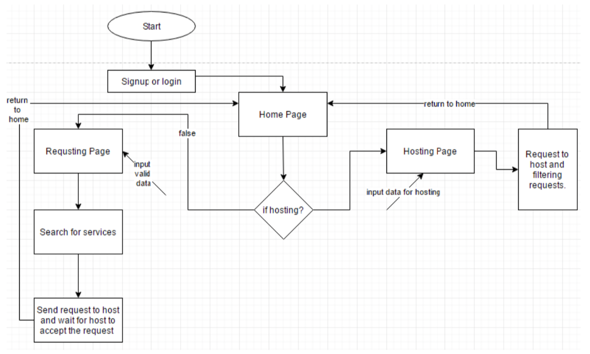
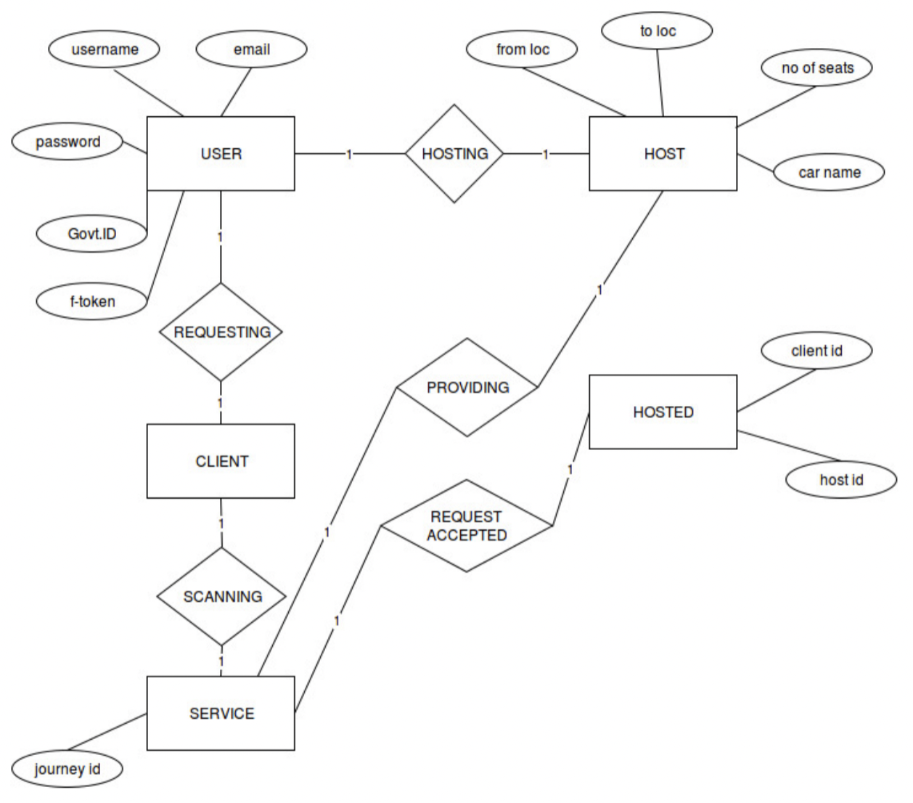
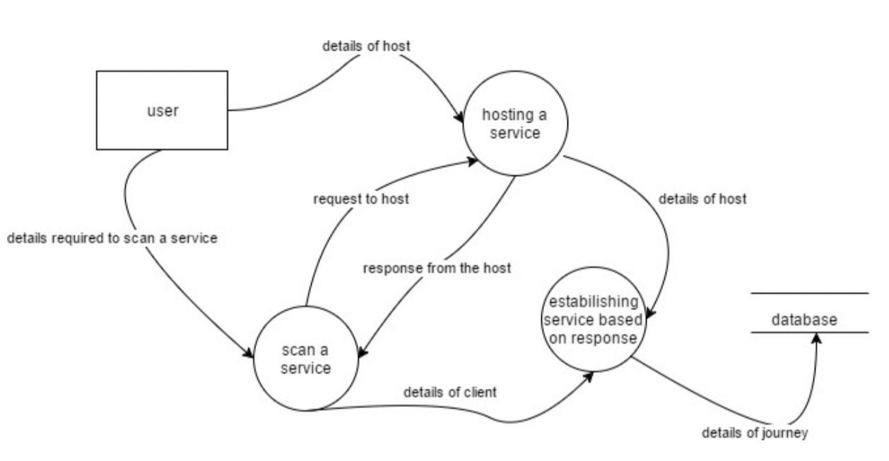

# Basic Ride Sharing Application
A Ride sharing application with bare minimun features.
Use Cases :
- A user who wishes to offer ride can host the service specifying the route.
- A naive user can search for users hosting services to the desired location and request for the service.
The backend is implemented using PHP.

### Requirements
- Android Studio
- PHP 7.0
- MySQL database
- Firebase Cloud API

### Design Block Diagram

### ER Diagram

### Dataflow Diagram

